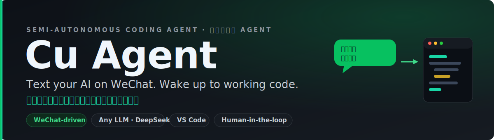
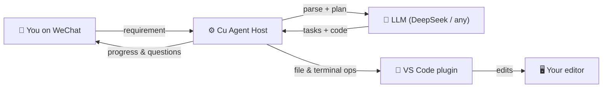
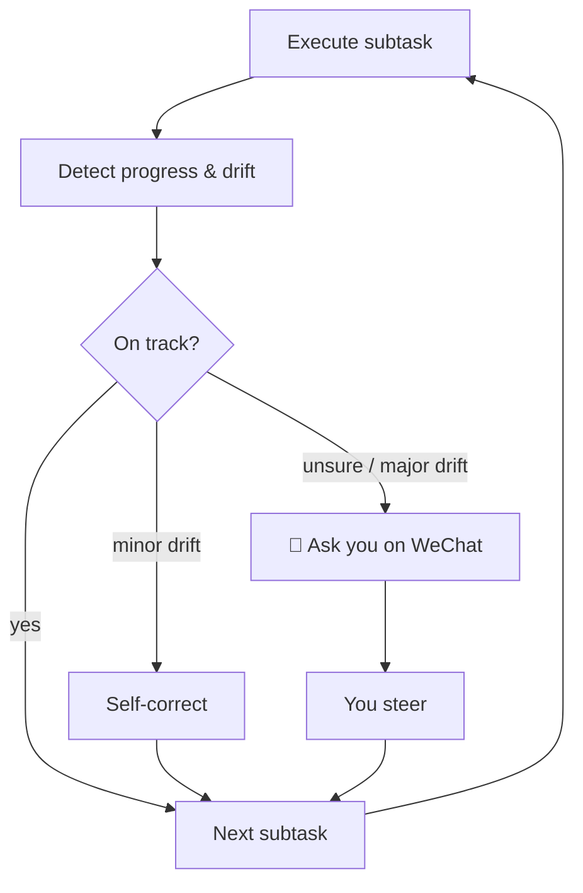

<div align="center">



<br/>

**English** · [简体中文](README.zh-CN.md)

<p>
  <a href="https://github.com/Wang-Yeah623/cu-agent/actions/workflows/ci.yml"></a>
  
  
  = 18">
  
  <a href="https://github.com/Wang-Yeah623/cu-agent/stargazers"></a>
</p>

### Text a requirement to WeChat. Cu Agent plans it, writes the code on your computer, and pings you back with progress — pausing to ask when it's unsure.

</div>

---

> [!NOTE]
> **Status: early / alpha.** The full loop works end-to-end (WeChat → LLM → editor → code), verified with DeepSeek and a VS Code extension. APIs and UX are still moving fast. ⭐ Star it to follow along — issues & PRs very welcome.

## ✨ Why Cu Agent

Most AI coding agents chain you to an IDE, babysitting every step. **Cu Agent flips that:**

- 📱 **Drive it from your phone** — kick off a project with a WeChat message, from anywhere.
- 🔁 **Async & semi-autonomous** — it breaks the goal into subtasks and works through them on your machine.
- 🧠 **Human-in-the-loop, not fire-and-forget** — after each step it *detects progress and drift*. Minor drift it self-corrects; when it's genuinely unsure it **asks you on WeChat** instead of barreling ahead.
- 🖥️ **It drives your editor** — file edits and commands run through a VS Code extension (and gracefully fall back to local files if no editor is connected).
- 🔌 **Any OpenAI-compatible LLM** — DeepSeek, Ollama, OpenAI… switch with one env var.

## 🎬 Demo

> A short screen-recording is on the way. Here's a real run (mock-WeChat ↔ Cu Agent, powered by DeepSeek):

```text
📱 You          帮我做一个个人博客网站
🤖 Cu Agent     收到需求，正在分析…正在拆解任务
🤖 Cu Agent     ✅ 项目已创建，开始执行
🤖 Cu Agent     🔨 创建项目目录和基础文件
🤖 Cu Agent     📊 进度 10% · 下一步：编写 HTML 结构
🤖 Cu Agent     🔨 编写 HTML 结构   →  index.html 生成并在 VS Code 中打开
🤖 Cu Agent     📊 进度 30% · 继续推进…
```

## 🧩 How it works



The differentiator is the **execution loop** — it checks itself after every step instead of one-shotting:



## 🚀 Quick start

```bash
git clone https://github.com/Wang-Yeah623/cu-agent.git
cd cu-agent
npm install
npm test          # 47 tests
npm run build     # compile to dist/
```

Point it at a model (any OpenAI-compatible endpoint — DeepSeek shown):

```bash
# PowerShell / bash — set these, then run the host
setx HERMES_API_ENDPOINT "https://api.deepseek.com"   # no /v1, the client adds it
setx HERMES_API_KEY      "sk-your-deepseek-key"
setx HERMES_MODEL        "deepseek-chat"               # supports tool-calls
setx WECHAT_WEBHOOK_URL  "https://qyapi.weixin.qq.com/cgi-bin/webhook/send?key=xxx"
setx CODEX_BINDING_KEY   "your-binding-key"

node dist/main.js
```

Want the agent to drive **VS Code**? See [`cu-plugin-codex/`](cu-plugin-codex) — `npm install` there, press **F5**, and the editor connects on `ws://127.0.0.1:9876`.

## ⚙️ Configuration

| Env var | Required | Default | Notes |
|---|:---:|---|---|
| `HERMES_API_ENDPOINT` | ❌ | `http://localhost:11434` | OpenAI-compatible base URL (**no** `/v1`) |
| `HERMES_API_KEY` | ❌ | – | Bearer token for the LLM |
| `HERMES_MODEL` | ❌ | `hermes-3-llama-3.1-8b` | e.g. `deepseek-chat` |
| `WECHAT_WEBHOOK_URL` | ✅ | – | WeChat Work bot webhook |
| `CODEX_BINDING_KEY` | ✅ | – | Editor plugin binding key |
| `CODEX_PLUGIN_PORT` | ❌ | `9876` | Must match the VS Code plugin |
| `CU_PROJECTS_DIR` | ❌ | `./projects` | Where generated code lands (sandbox root) |

## 🛡️ Safety

- **Path sandbox** — file ops are confined to the project dir (`..` traversal blocked).
- **Command gate** — a blocklist of destructive commands; deletes require approval.
- **Human approval** — risky actions wait for your confirmation, with a timeout.

## 🗂️ Architecture

<details>
<summary>Module map</summary>

```
src/
├── core/         types · protocol · prompts · constants
├── hermes/       LLM client · intent parser · task planner · progress detector
├── registry/     plugin registry · security gate (sandbox + approvals)
├── executor/     Codex/VS Code adapter · terminal · filesystem
├── loop/         execution loop · state machine · state store (persistence)
├── wechat/       Clawbot bridge · message router
├── host/         app wiring + HTTP server
└── main.ts       entry point

cu-plugin-codex/  the VS Code extension (editor side)
```
</details>

## 🗺️ Roadmap

- [ ] One-command / Docker quick start & a no-WeChat web demo mode
- [ ] Resume an interrupted project (persistence groundwork is in)
- [ ] Real WeChat Work webhook integration guide
- [ ] Dependency-aware task ordering
- [ ] Showcase gallery of generated projects

## 🤝 Contributing

PRs and issues are welcome! `npm test` must stay green and `npx tsc --noEmit` clean. See [CONTRIBUTING](CONTRIBUTING.md).

## 📜 License

[MIT](LICENSE) © 2026 Wang-Yeah623 and contributors.
