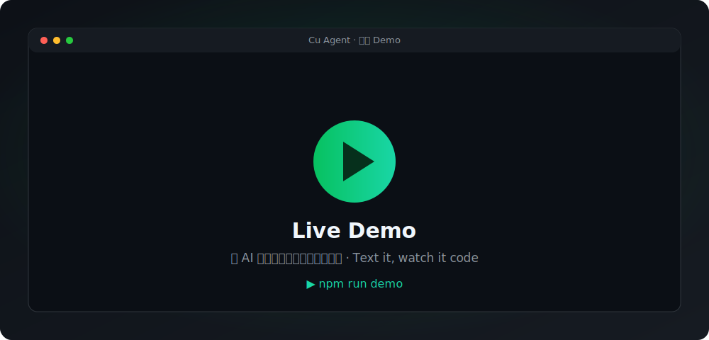
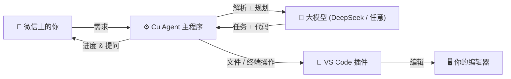
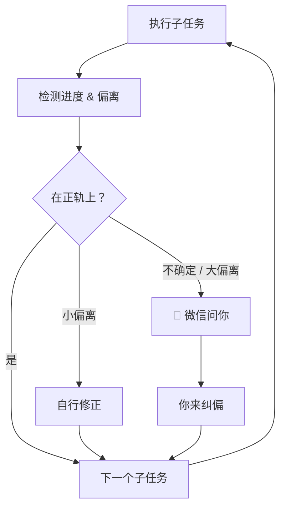

<div align="center">


<br/>

[English](README.md) · **简体中文**

<p>
  <a href="https://github.com/Wang-Yeah623/cu-agent/actions/workflows/ci.yml"></a>
  <a href="https://wang-yeah623.github.io/cu-agent/"></a>
  
  
  = 18">
  
  <a href="https://github.com/Wang-Yeah623/cu-agent/stargazers"></a>
</p>

### 给微信发条需求，Cu Agent 帮你拆解、在你电脑上把代码写好，并实时把进度发回微信 —— 不确定时还会停下来问你。

</div>

---

> [!NOTE]
> **状态：早期 / alpha。** 整条闭环已端到端跑通（微信 → 大模型 → 编辑器 → 代码），并用 DeepSeek + 一个 VS Code 扩展验证过。接口和体验仍在快速迭代。⭐ Star 一下持续关注 —— 欢迎提 issue 和 PR。

## ✨ 为什么是 Cu Agent

大多数 AI 编程 agent 把你绑在 IDE 里，每一步都得盯着。**Cu Agent 反过来：**

- 📱 **用手机指挥** —— 在任何地方，给微信发条消息就能开一个项目。
- 🔁 **异步、半自主** —— 它把需求拆成子任务，在你电脑上一个个推进。
- 🧠 **人在环里，而非一次性甩锅** —— 每步之后它都会*检测进度和偏离*。小偏离自行修正；真拿不准时，它会**在微信上问你**，而不是闷头乱写。
- 🖥️ **它操控你的编辑器** —— 文件改动和命令通过 VS Code 扩展执行（没连编辑器时优雅退化为本地直接写文件）。
- 🔌 **任意 OpenAI 兼容大模型** —— DeepSeek、Ollama、OpenAI…… 改一个环境变量就能换。

## 🎬 演示

<p align="center">
  <!-- 🎥 录好后：把 GIF 存成 assets/demo.gif，删掉下面这行占位图，取消注释再下一行。 -->
  
  <!--  -->
</p>

<p align="center"><sub>📹 演示 GIF 马上补 —— 用 <code>npm run demo</code> 30 秒录一段 · <a href="assets/DEMO_SCRIPT.md">分镜脚本</a></sub></p>

下面是一次真实运行（模拟微信 ↔ Cu Agent，由 DeepSeek 驱动）：

```text
📱 你           帮我做一个个人博客网站
🤖 Cu Agent     收到需求，正在分析…正在拆解任务
🤖 Cu Agent     ✅ 项目已创建，开始执行
🤖 Cu Agent     🔨 创建项目目录和基础文件
🤖 Cu Agent     📊 进度 10% · 下一步：编写 HTML 结构
🤖 Cu Agent     🔨 编写 HTML 结构   →  index.html 生成并在 VS Code 中打开
🤖 Cu Agent     📊 进度 30% · 继续推进…
```

## 🧩 工作原理



真正的差异化是**执行循环** —— 它每步都自检，而不是一次性生成：



## 🚀 快速开始

```bash
git clone https://github.com/Wang-Yeah623/cu-agent.git
cd cu-agent
npm install
npm test          # 47 个测试
npm run build     # 编译到 dist/
```

接一个模型（任意 OpenAI 兼容端点，下面用 DeepSeek）：

```bash
setx HERMES_API_ENDPOINT "https://api.deepseek.com"   # 别带 /v1，客户端会自动补
setx HERMES_API_KEY      "sk-你的DeepSeek密钥"
setx HERMES_MODEL        "deepseek-chat"               # 支持 function calling
setx WECHAT_WEBHOOK_URL  "https://qyapi.weixin.qq.com/cgi-bin/webhook/send?key=xxx"
setx CODEX_BINDING_KEY   "你的绑定密钥"

node dist/main.js
```

### 🌐 在浏览器里试 —— 免微信、免 VS Code

```bash
npm run demo     # 先设好上面的 HERMES_API_KEY
# 打开 http://localhost:8787，输入需求，实时看它拆任务 + 写代码
```

想让 agent 操控 **VS Code**？见 [`cu-plugin-codex/`](cu-plugin-codex)：在该目录 `npm install`，按 **F5**，编辑器即在 `ws://127.0.0.1:9876` 接入。

## ⚙️ 配置

| 环境变量 | 必填 | 默认 | 说明 |
|---|:---:|---|---|
| `HERMES_API_ENDPOINT` | ❌ | `http://localhost:11434` | OpenAI 兼容 base URL（**不要**带 `/v1`）|
| `HERMES_API_KEY` | ❌ | – | 大模型的 Bearer token |
| `HERMES_MODEL` | ❌ | `hermes-3-llama-3.1-8b` | 如 `deepseek-chat` |
| `WECHAT_WEBHOOK_URL` | ✅ | – | 企业微信机器人 Webhook |
| `CODEX_BINDING_KEY` | ✅ | – | 编辑器插件绑定密钥 |
| `CODEX_PLUGIN_PORT` | ❌ | `9876` | 需与 VS Code 插件一致 |
| `CU_PROJECTS_DIR` | ❌ | `./projects` | 生成代码的目录（沙箱根）|

## 🛡️ 安全

- **路径沙箱** —— 文件操作限制在项目目录内（拦截 `..` 穿越）。
- **命令门控** —— 危险命令黑名单；删除操作需审批。
- **人工确认** —— 高风险动作等你确认，且有超时保护。

## 🗺️ 路线图

- [ ] 一条命令 / Docker 启动 & 免企业微信的网页 demo 模式
- [ ] 中断后续跑（持久化地基已铺好）
- [ ] 真·企业微信 Webhook 接入指南
- [ ] 按依赖拓扑排序任务
- [ ] 生成项目的展示画廊

## 🤝 参与贡献

欢迎 PR 和 issue！`npm test` 要保持全绿、`npx tsc --noEmit` 要干净。详见 [CONTRIBUTING](CONTRIBUTING.md)。

## 📜 License

[MIT](LICENSE) © 2026 Wang-Yeah623 与贡献者。
